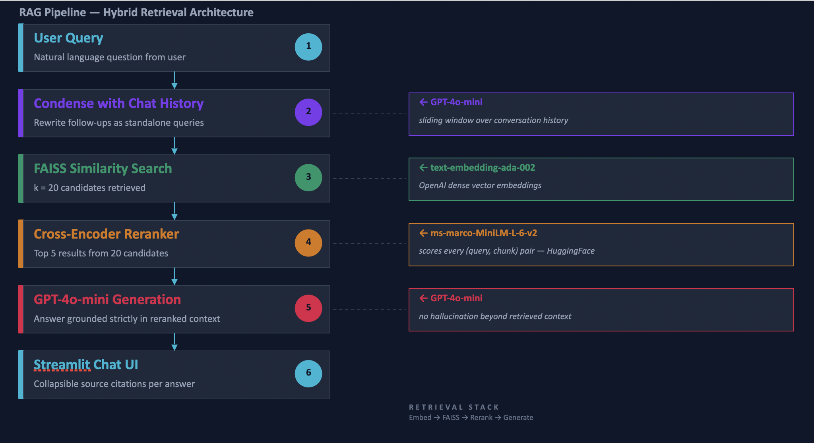

# RAG Q&A Assistant

A production-ready **Retrieval-Augmented Generation (RAG)** application with a two-stage retrieval pipeline, conversational memory, and a Streamlit chat interface — containerized with Docker for one-command deployment.

---

## Highlights

| | |
|---|---|
| **Two-stage retrieval** | FAISS vector search narrows to 20 candidates; a cross-encoder reranker scores every query–chunk pair and keeps the 5 most relevant — dramatically reducing hallucination vs. naive top-k. |
| **Conversational memory** | A sliding-window condenser rewrites follow-up questions into standalone queries so retrieval stays accurate across multi-turn conversations. |
| **Production packaging** | `pyproject.toml` with optional dev extras, multi-stage Dockerfile (non-root user, health check), and Docker Compose for zero-config local deployment. |
| **Modular LCEL pipeline** | Each stage (embed → retrieve → rerank → generate) is an independent, swappable LangChain Expression Language component. |
| **Source citations** | Every answer exposes the exact retrieved chunks in a collapsible UI panel for full transparency. |

---

## Architecture



### Why two-stage retrieval?

Vector similarity (bi-encoder) is fast but scores query and document independently — it misses fine-grained relevance. A cross-encoder reads the query and each candidate chunk *together*, giving a much more accurate relevance score at the cost of speed. The two-stage design gets the best of both: FAISS handles scale, the cross-encoder handles precision.

---

## Tech Stack

| Layer | Technology |
|---|---|
| LLM | OpenAI GPT-4o-mini |
| Embeddings | OpenAI text-embedding-ada-002 |
| Vector store | FAISS (CPU) |
| Reranker | HuggingFace cross-encoder/ms-marco-MiniLM-L-6-v2 |
| Orchestration | LangChain / LCEL |
| UI | Streamlit |
| Packaging | pyproject.toml + hatchling |
| Deployment | Docker (multi-stage) + Docker Compose |

---

## Project Structure

```
RAG/
├── src/
│   ├── loader.py        # PDF ingestion and recursive text chunking
│   ├── vector_store.py  # FAISS index construction with OpenAI embeddings
│   ├── reranker.py      # Cross-encoder reranking via ContextualCompressionRetriever
│   └── chain.py         # LCEL conversational RAG chain (condense → retrieve → generate)
├── app.py               # Streamlit app — caching, session state, chat UI
├── resources/
│   └── Approved IP Law.pdf
├── Dockerfile           # Multi-stage build, non-root user, health check
├── docker-compose.yml
├── pyproject.toml       # Dependencies, dev extras, ruff/mypy/pytest config
└── .env.example
```

---

## Quick Start

### Docker (recommended)

```bash
git clone https://github.com/AdibaShaikh000/RAG.git
cd RAG
cp .env.example .env          # add your OPENAI_API_KEY
docker compose up --build
```

Open [http://localhost:8501](http://localhost:8501).

### Local development

```bash
python3.11 -m venv .venv && source .venv/bin/activate
pip install -e ".[dev]"
streamlit run app.py
```

> On first run, the cross-encoder model (~85 MB) is downloaded automatically from HuggingFace.

---

## Architecture Decision Records

Key engineering trade-offs made during design, documented for transparency.

---

### ADR-001 — FAISS over managed vector databases (Pinecone, Weaviate, Chroma)

**Context:** The app needs a vector store for semantic search over PDF chunks. Managed options like Pinecone offer persistence and scalability out of the box.

**Decision:** Use FAISS (in-memory, CPU).

**Rationale:**
- Documents are loaded per-session and scoped to a single user — there is no need to persist embeddings across restarts.
- FAISS search over ~hundreds of chunks completes in <5 ms, far faster than a network round-trip to a managed service.
- Eliminates an external runtime dependency, keeping the Docker image self-contained and cost-free.

**Trade-off:** Not suitable if documents grow to millions of chunks or multi-user persistence is required. Swap path: replace `vector_store.py` with a `PineconeVectorStore` backed by the same embeddings — the rest of the pipeline is unchanged.

---

### ADR-002 — Two-stage retrieval (bi-encoder → cross-encoder) over single-stage top-k

**Context:** Simple top-k cosine retrieval with a bi-encoder is the default RAG approach. It's fast but retrieves by approximate similarity rather than true query–chunk relevance.

**Decision:** Retrieve k=20 with FAISS, then rerank with `cross-encoder/ms-marco-MiniLM-L-6-v2`, keeping top 5.

**Rationale:**
- Bi-encoders embed query and document independently, missing token-level interactions. Cross-encoders read both together, making them significantly more accurate relevance estimators.
- MiniLM-L-6-v2 runs on CPU in ~200–350 ms for 20 pairs — fast enough for an interactive UI without a GPU.
- Reducing context from 20 → 5 chunks cuts LLM input tokens by ~60%, lowering cost and reducing noise sent to the model.

**Trade-off:** Adds ~300 ms latency and a one-time ~85 MB model download. Eliminated with a smaller reranker or by reducing k if latency is the priority.

---

### ADR-003 — GPT-4o-mini over GPT-4o

**Context:** The LLM is only responsible for synthesis over a small, pre-filtered context (≤5 chunks). Retrieval quality, not model size, is the primary driver of answer quality in RAG.

**Decision:** Use `gpt-4o-mini`.

**Rationale:**
- At this context size (~1,000 input tokens), GPT-4o-mini and GPT-4o produce near-identical answers — the limiting factor is retrieval, not reasoning capacity.
- GPT-4o-mini is ~15× cheaper on input tokens and ~7× cheaper on output tokens vs. GPT-4o.
- Lower latency (~1–2 s vs. ~3–5 s) keeps the UI responsive.

**Trade-off:** Complex multi-step reasoning or cross-document synthesis would benefit from GPT-4o. The model is a single parameter in `build_chain()`, making it trivial to upgrade.

---

### ADR-004 — Streamlit over FastAPI + React

**Context:** The project needs a UI for demonstrating the RAG pipeline interactively.

**Decision:** Use Streamlit.

**Rationale:**
- Streamlit's `st.cache_resource` handles the expensive embedding + FAISS build step with one decorator — no cache layer to implement manually.
- Session state management for multi-turn chat is built-in.
- A production-quality demo is achievable in a single file, keeping the focus on the RAG pipeline rather than frontend boilerplate.

**Trade-off:** Not suitable for a multi-user production service (no auth, single-threaded per session). Swap path: expose the LCEL chain via a FastAPI endpoint; the `src/` modules require zero changes.

---

## Dataset

The default document is the **Approved IP Law PDF** sourced from the [omar87/pdf-laws](https://huggingface.co/datasets/omar87/pdf-laws) HuggingFace dataset. Any PDF can be swapped in via the sidebar upload.
